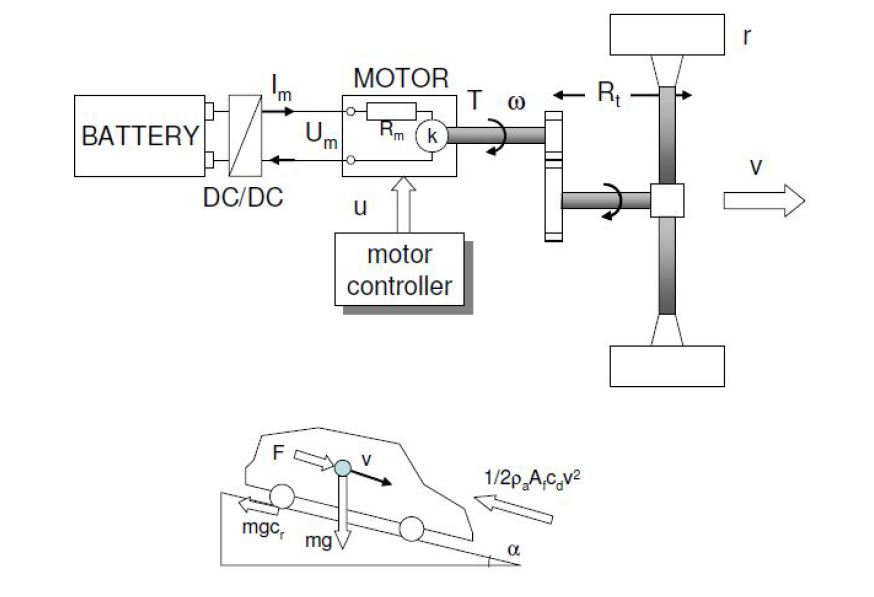

# Project - Technical Report on Optimal Control for eCAV's

* This Project is a Technical Report on the below paper

`Jihun Han , Antonio Sciarretta, Luis Leon Ojeda, Giovanni De Nunzio, and Laurent Thibault,
"Safe- and Eco-Driving Control for Connected andAutomated Electric Vehicles Using Analytical
State-Constrained Optimal Solution", IEEE TRANSACTIONS ON INTELLIGENT VEHICLES, VOL. 3,
NO. 2, JUNE 2018.`

* This project performs an in-depth mathematical analysis of the above paper
* The project also derives the mathematical formulations of the paper
* This project also reproduces the theoritical results of the paper 

<em>System Model</em>

## Results
The results of this project can be viewed here `report/ENPM667 Final Report Project1.pdf`
